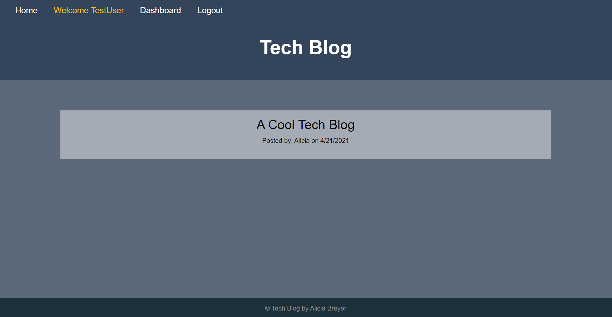
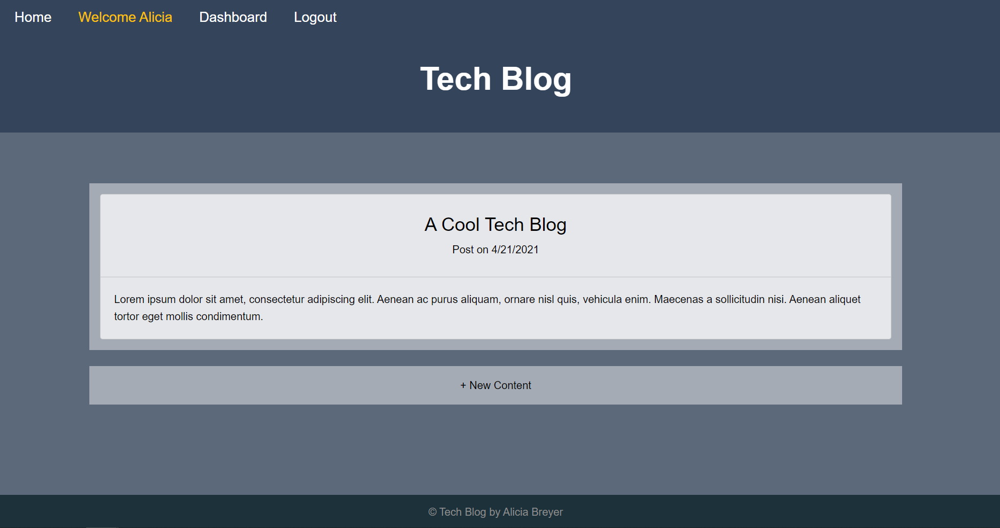
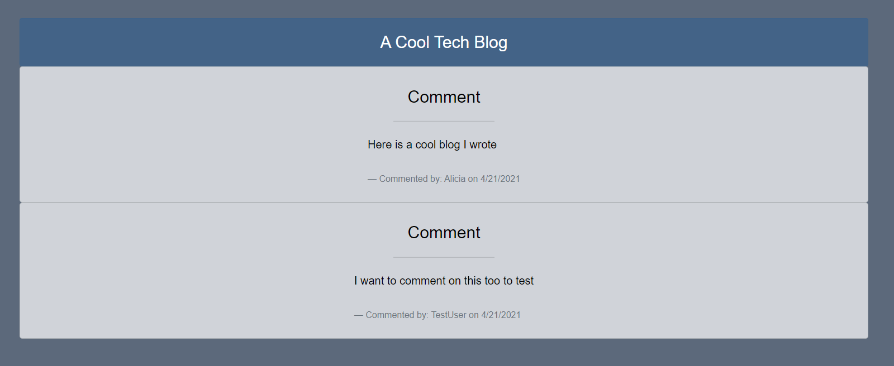
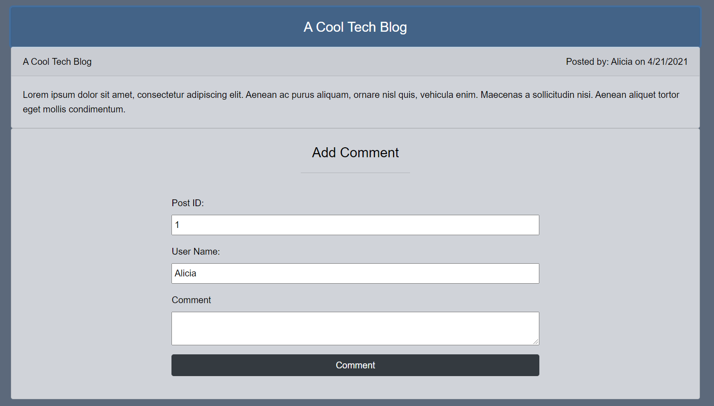
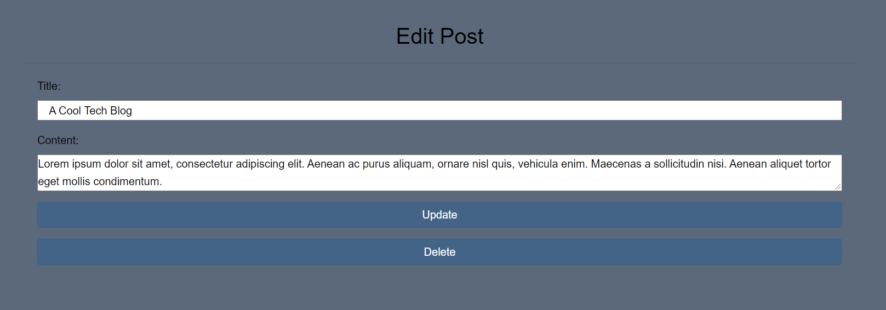

# dev-tech-blog

 

## Description

An application that allows you to create an account/log in, and when signed in create, update, or delete blogs. Users can also comment on other people's posts when logged in. Go [here](https://gentle-escarpment-54377.herokuapp.com/) to try it yourself or [watch the walkthrough video](https://drive.google.com/file/d/1s1B8OqxjfEMIvcVOYYuKW78Z390iMx67/view?usp=sharing).

## Table of Contents

- [Description](#description)
- [Usage](#usage)
- [Images](#images)
- [License](#license)
- [Technology Used](#technology-used)

## How-To

- Go to the [live site](https://gentle-escarpment-54377.herokuapp.com/)
- Click on log in and then sign up
- Click on the + New Content button to add a blog
- Create a post by adding a title and desired content. When done click create
- To edit/delete, on your dashboard click on the post and it will take you to an update/delete page
- Go to the home page to see other blogs. Click on one to see more and comment

### Usage

- [video of how to use dev-tech-blog](https://drive.google.com/file/d/1s1B8OqxjfEMIvcVOYYuKW78Z390iMx67/view?usp=sharing)

### Images

### License

MIT License

### Technology-Used

1. Javascript
2. Node.js
3. Node packages
   - MySQL
   - connect-session-sequelize
   - express-session
   - handlebars
   - dotenv
   - bcrypt
   - express
   - mysql2
   - sequelize
4. MySQL Database
5. Heroku / JawsDB (Database)
